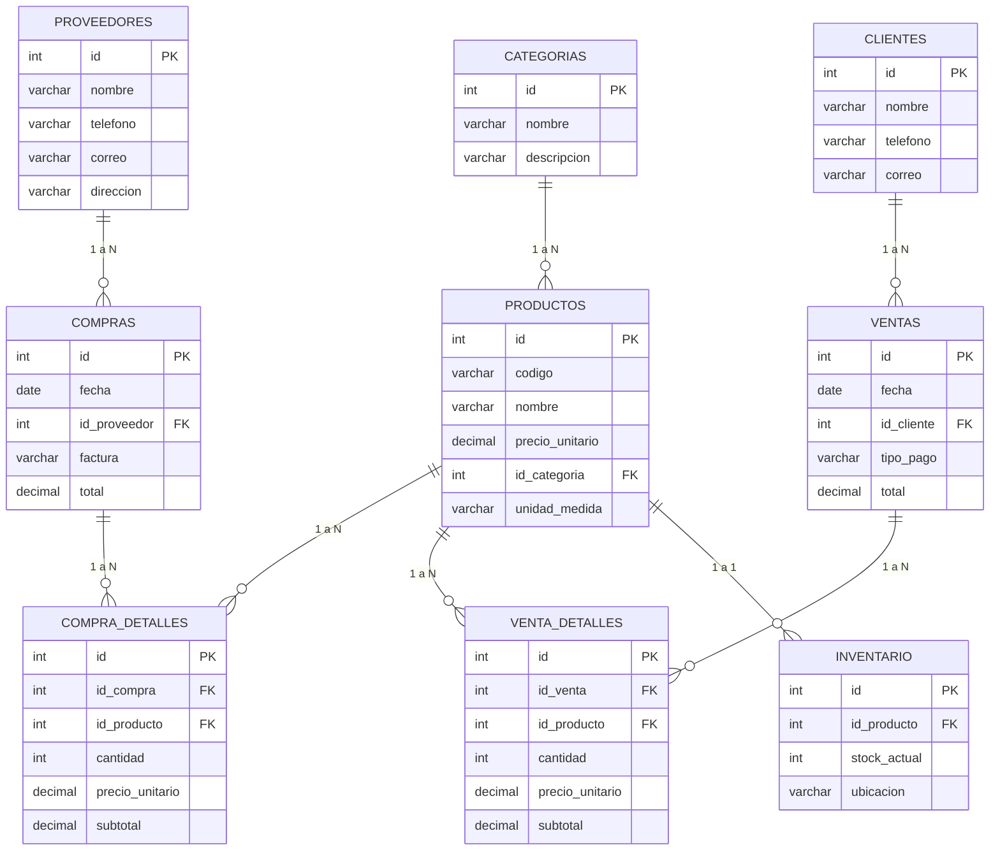

```mermaid
erDiagram
    CATEGORIAS {
        int id PK
        varchar nombre
        varchar descripcion
    }
    PRODUCTOS {
        int id PK
        varchar codigo
        varchar nombre
        decimal precio_unitario
        int id_categoria FK
        varchar unidad_medida
    }
    PROVEEDORES {
        int id PK
        varchar nombre
        varchar telefono
        varchar correo
        varchar direccion
    }
    COMPRAS {
        int id PK
        date fecha
        int id_proveedor FK
        varchar factura
        decimal total
    }
    COMPRA_DETALLES {
        int id PK
        int id_compra FK
        int id_producto FK
        int cantidad
        decimal precio_unitario
        decimal subtotal
    }
    VENTAS {
        int id PK
        date fecha
        int id_cliente FK
        varchar tipo_pago
        decimal total
    }
    VENTA_DETALLES {
        int id PK
        int id_venta FK
        int id_producto FK
        int cantidad
        decimal precio_unitario
        decimal subtotal
    }
    CLIENTES {
        int id PK
        varchar nombre
        varchar telefono
        varchar correo
    }
    INVENTARIO {
        int id PK
        int id_producto FK
        int stock_actual
        varchar ubicacion
    }

    CATEGORIAS ||--o{ PRODUCTOS : "1 a N"
    PRODUCTOS ||--o{ COMPRA_DETALLES : "1 a N"
    PRODUCTOS ||--o{ VENTA_DETALLES : "1 a N"
    PROVEEDORES ||--o{ COMPRAS : "1 a N"
    COMPRAS ||--o{ COMPRA_DETALLES : "1 a N"
    VENTAS ||--o{ VENTA_DETALLES : "1 a N"
    CLIENTES ||--o{ VENTAS : "1 a N"
    PRODUCTOS ||--o{ INVENTARIO : "1 a 1"
```